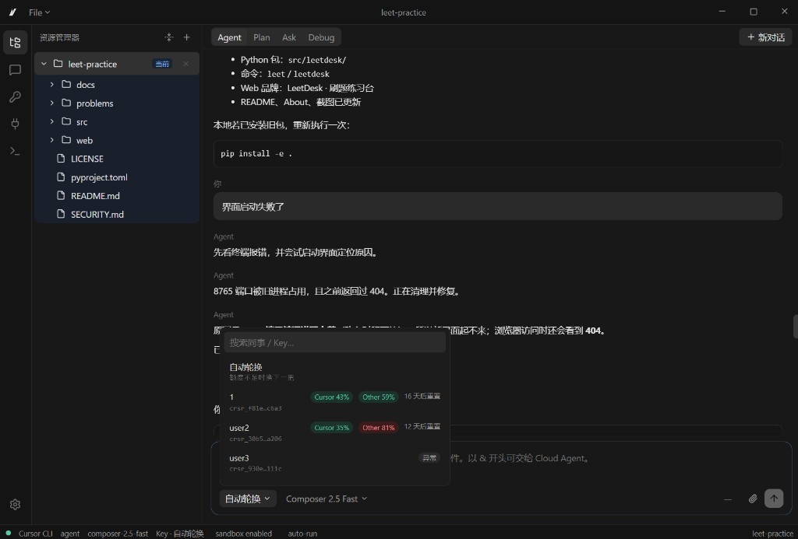

# Cursor CLI Desk

用 Cursor 风格的桌面来跑 **Cursor CLI**。内置本地 **API Key 池**：多把 Key 在本机管理，额度用尽或鉴权失败时自动切换。

社区项目，不是 Cursor 官方产品，也不是 Cursor 编辑器本身。

[下载](https://github.com/GioGioBond/cursor-cli-desk/releases) · [使用说明页](https://giogiobond.github.io/cursor-cli-desk/)

## 怎么用

**推荐免安装版**（`win-unpacked`）：

1. 打开 [Releases](https://github.com/GioGioBond/cursor-cli-desk/releases/latest)
2. 下载 `CursorCLIDesk-1.0.0-win-unpacked.zip`
3. 解压后运行 `Cursor CLI Desk.exe`

不必安装 Node.js，也不用编译源码。把文件夹放在哪，程序和数据就在哪。

可选：同一页里的 `CursorCLIDesk-Setup-1.0.0.exe`。安装默认目录是安装包所在位置，可以改。

本机没有 Cursor CLI 时，第一次运行会自动装到程序同一目录的 `cursor-agent`。

## 使用要点

- 启动后资源管理器是空的。用 **File → 打开文件夹**（或侧栏 `+`）选项目。对话和文件都绑定当前工作区。
- 打开已经在 Cursor 里用过的项目文件夹，可以加载并续上该项目的历史对话。
- 在「API Key 池」里添加 Cursor API Key。Key 只保存在本机，写在程序旁边的 `.cli-desk`。
- Agent / Plan / Ask / Debug、斜杠命令、MCP、沙箱仍走官方 CLI。

## 文件放哪

| 内容 | 位置 |
|------|------|
| 程序 | 解压目录（或你选的安装目录） |
| 设置、Key、Desk 对话 | 程序旁边的 `.cli-desk`（第一次运行才生成） |
| Cursor 编辑器自己的聊天记录 | 仍在 Cursor 用户目录，Desk 只读取来续聊 |

卸载 Desk 不会删除本机已有的 Cursor CLI。删程序文件夹即可；若要清数据，一并删 `.cli-desk`。

## License

[MIT](LICENSE)
